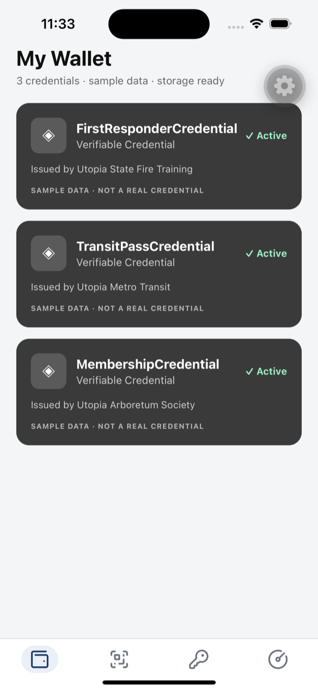
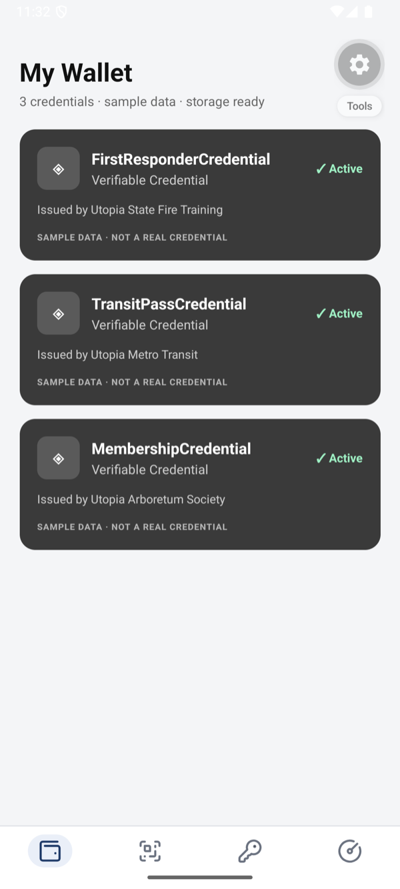
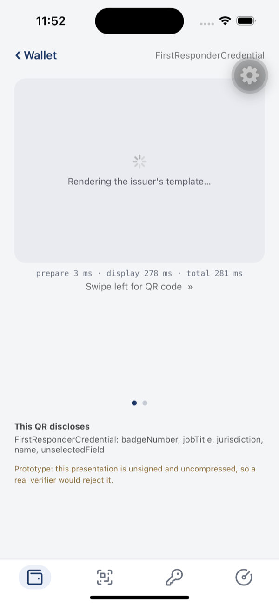
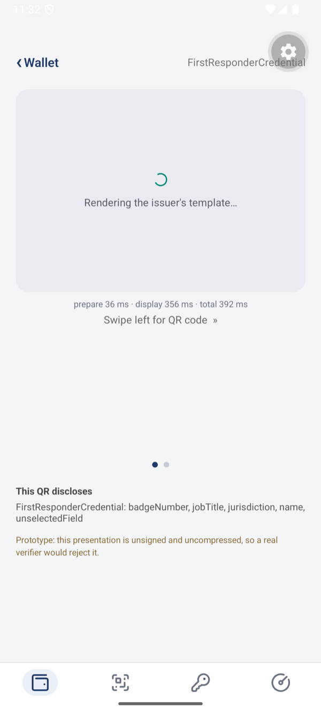
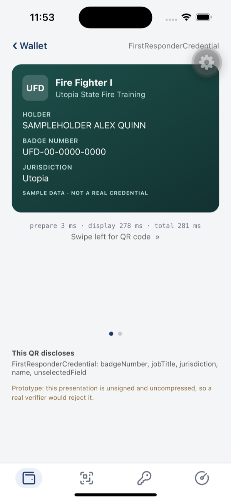
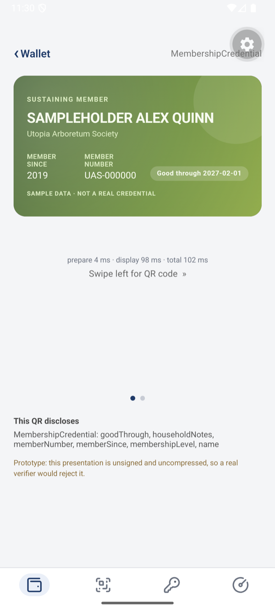

<!--
Copyright (c) 2026 Digital Bazaar, Inc. All rights reserved.
-->

# The demo, on device

Captured from the iOS Simulator (iPhone 15) and an Android emulator
(Medium Phone, API 35), both running this repository unchanged.

## The wallet list

Three credentials, each carrying an `html` render method. The list itself uses
the wallet's own layout — a render method draws the detail view, not the row.

| iOS | Android |
|---|---|
|  |  |

## While the template renders

Tapping a credential opens a single-credential page. The card is hidden until
the template signals `renderMethodReady()` over its `MessagePort`, so a
half-drawn card is never shown. A template that never signals is displayed
anyway after five seconds, with a warning.

| iOS | Android |
|---|---|
|  |  |

This state is normally too brief to see — these were captured with the card
held in its loading state deliberately.

## The issuer's card

The markup, layout, and colors come from the template the issuer shipped inside
the credential. The wallet contributes the surrounding page.

| iOS — first responder badge | Android — arboretum membership |
|---|---|
|  |  |

Two of the three bundled templates, chosen to show that the layout is the
issuer's decision: one portrait badge with a seal and a field list, one
landscape membership card whose renewal pill is computed by the template rather
than carried as a field.

## Timings

The line under each card reports two phases:

- **prepare** — filtering the credential to its `renderProperty` fields and
  verifying the template's SHA-256 digest, in JavaScript.
- **display** — the WebView mounting, the sandboxed iframe being created, the
  template executing, and its ready signal arriving back.

| Capture | prepare | display | total |
|---|---|---|---|
| Android, membership card | 4 ms | 98 ms | **102 ms** |
| Android, first responder badge | 3 ms | 130 ms | **133 ms** |
| iOS, first responder badge (cold) | 3 ms | 278 ms | **281 ms** |

The JavaScript half is a few milliseconds; the cost is the WebView. The iOS
figure is a **cold** first open, where the engine starts up as part of the
measurement — the Android figures are warm. Expect the first credential opened
in a session to be the slow one and every later one to land near 100 ms.

These are **debug builds on a simulator and an emulator**. A release build on
real hardware was not measured.
